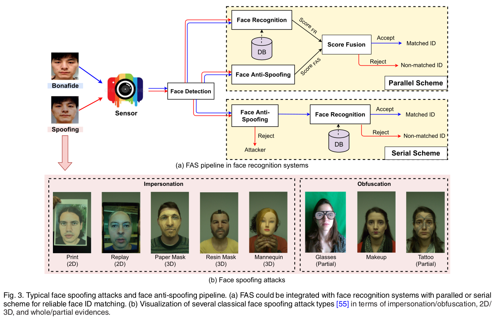
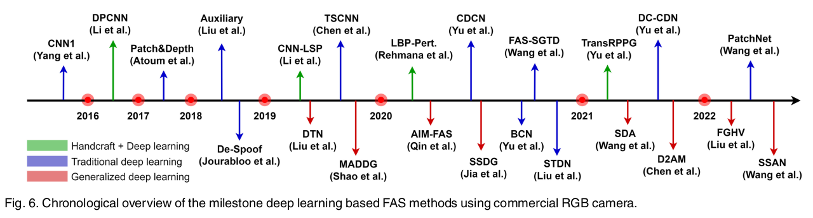

# まばたきを検知するPythonコードの解説


- [まばたきを検知するPythonコードの解説](#まばたきを検知するpythonコードの解説)
  - [はじめに](#はじめに)
  - [まばたき検知の原理](#まばたき検知の原理)
  - [実際のコード](#実際のコード)


## はじめに
顔のなりすまし対策は、顔認識システムのセキュリティにとって重要です。
まばたき検知は、このアンチスプーフィング手法の1つとして用いられます。

アンチスプーフィングについてのサーベイ論文は、2023年の[Deep Learning for Face Anti-Spoofing: A Survey](https://arxiv.org/abs/2106.14948)が詳しいです。この論文ではさまざまなアンチスプーフィング手法と、それに対する研究が紹介されています。




> Most traditional algorithms are designed based on human liveness cues and handcrafted features, which need rich task-aware prior knowledge for design. In term of the methods based on the liveness cues, eye-blinking [2], [7], [8], face and head movement [9], [10] (e.g., nodding and smiling), gaze tracking [11], [12] and remote physiological signals (e.g., rPPG [3], [13], [14], [15]) are explored for dynamic discrimination.
> However, these physiological liveness cues are usually captured from long-term interactive face videos, which is inconvenient for practical deployment.
> 
> 従来のアルゴリズムのほとんどは、人間の活力の合図と手作りの機能に基づいて設計されており、設計にはタスクを意識した豊富な事前知識が必要です。生体情報に基づく方法としては、まばたき [2]、[7]、[8]、顔や頭の動き [9]、[10] (うなずきや笑顔など)、視線追跡 [11] 、[12] および遠隔生理学的信号 (例: rPPG [3]、[13]、[14]、[15]) は動的識別のために研究されています。
> ただし、これらの生理学的活力の手がかりは通常、長期にわたるインタラクティブな顔のビデオからキャプチャされるため、実際の展開には不便です。

このような理由から、近年ではディープラーニングを用いたアンチスプーフィング手法が注目されています。

とはいえ、ディープラーニングを用いたアンチスプーフィング手法は、データセットの不足や、データセットの偏り、データセットの大きさなどの問題があります。また、照度やカメラ性能により、現実のシーンでは使いづらい麺もあります。そのため、ディープラーニングを用いたアンチスプーフィング手法は、まだまだ研究段階にあります。

この記事では、伝統的なアンチスプーフィング手法の1つである、まばたき検知をPythonで実装してみます。

## まばたき検知の原理
眼のアスペクト比（Eye Aspect Ratio: EAR）は、目の開き具合を数値で表す指標です。EARは目のランドマーク（特定の点）に基づいて計算されます。具体的には、目の上縁と下縁にある点（\( p_2, p_3, p_5, p_6 \)）と、目の左端と右端にある点（\( p_1, p_4 \)）を使用します。

\[
\text{EAR} = \frac{{||p_2 - p_6|| + ||p_3 - p_5||}}{2 \times ||p_1 - p_4||}
\]

この式で使用されている \( || \cdot || \) はユークリッド距離を表します。

- \( ||p_2 - p_6|| \) と \( ||p_3 - p_5|| \) は、それぞれ目の上縁と下縁の距離を計算します。これらの距離が大きいほど、目は開いていると言えます。
- \( ||p_1 - p_4|| \) は目の左端と右端の距離を計算します。この距離は目が開いているか閉じているかにかかわらず、ほぼ一定です。

EARの値は、目が開いているときには比較的大きく、目が閉じているときには小さくなります。この性質を利用して、瞬きを検出できます。具体的には、EARがある閾値よりも小さくなったときに瞬きが発生したと判断することが一般的です。

MediaPipeのFace Meshモデルにおいて、目のランドマークは以下のように対応しています：

- 左目（左から右へ）
  - \( p_1 \) : 33
  - \( p_2 \) : 159
  - \( p_3 \) : 145
  - \( p_4 \) : 133
  - \( p_5 \) : 153
  - \( p_6 \) : 144

- 右目（左から右へ）
  - \( p_1 \) : 263
  - \( p_2 \) : 386
  - \( p_3 \) : 374
  - \( p_4 \) : 362
  - \( p_5 \) : 380
  - \( p_6 \) : 373


くわしくは、[こちらの公式ドキュメント](https://developers.google.com/mediapipe/solutions/vision/face_landmarker)を参照してください。

これらのランドマーク番号を使用して、EARを計算できます。この情報を元に、`calculate_eye_ratio`関数を適切に修正することで、EARに基づいた瞬き検出が可能です。

実際は、トライアンドエラーを繰り返して「EARの閾値」を決定します。この閾値は、環境によって異なるため、一般的な値は存在しません。

## 実際のコード
まばたき検知のコードは、以下のようになります。

```python
import sys

sys.path.append('/usr/lib/python3/dist-packages')

import cv2
import mediapipe as mp
import numpy as np
import time

# 顔のランドマークを検出するためのモデルをロード
mp_face_mesh = mp.solutions.face_mesh
face_mesh = mp_face_mesh.FaceMesh()

# ビデオファイルからの入力を開始
cap = cv2.VideoCapture('assets/man.mp4')
# cap = cv2.VideoCapture('assets/happy.mp4')

# 眼の状態を追跡する変数
eye_open = True

# EARの閾値
EAR_THRESHOLD_CLOSE = 1.4  # 目が閉じていると判断する閾値
EAR_THRESHOLD_OPEN = 1.2   # 目が開いていると判断する閾値

blink_count = 0  # 瞬きの回数をカウント

frame_time = 1 / 30  # 1フレームの時間（秒単位）. 30fpsの場合は1/30

def calculate_eye_ratio(face_landmarks, eye_landmarks):
    # 眼のアスペクト比を計算する関数
    eye_points = np.array([[face_landmarks.landmark[i].x, face_landmarks.landmark[i].y] for i in eye_landmarks])
    # EAR計算
    A = np.linalg.norm(eye_points[1] - eye_points[5])
    B = np.linalg.norm(eye_points[2] - eye_points[4])
    C = np.linalg.norm(eye_points[0] - eye_points[3])
    eye_ratio = (A + B) / (2.0 * C)
    return eye_ratio

# 動画のフレームサイズを取得
width = int(cap.get(cv2.CAP_PROP_FRAME_WIDTH))
height = int(cap.get(cv2.CAP_PROP_FRAME_HEIGHT))
# 出力動画の設定
fourcc = cv2.VideoWriter_fourcc(*'mp4v')
out = cv2.VideoWriter('output.mp4', fourcc, 30.0, (width, height))

while cap.isOpened():
    start_time = time.time()  # フレーム処理の開始時間
    ret, image = cap.read()  # ビデオから画像を読み取る
    if not ret:
        print("画像を取得できませんでした")
        break

    # 画像を処理するためにBGRからRGBに変換
    image_rgb = cv2.cvtColor(image, cv2.COLOR_BGR2RGB)

    # 顔のランドマークを検出
    results = face_mesh.process(image_rgb)

    # 瞬きを検出
    if results.multi_face_landmarks:
        for face_landmarks in results.multi_face_landmarks:
            left_eye_ratio = calculate_eye_ratio(face_landmarks, [33, 246, 161, 160, 159, 158, 157, 173])
            right_eye_ratio = calculate_eye_ratio(face_landmarks, [263, 466, 388, 387, 386, 385, 384, 398])

            # 目が閉じていると判断
            if left_eye_ratio < EAR_THRESHOLD_CLOSE or right_eye_ratio < EAR_THRESHOLD_CLOSE:
                eye_open = False
            # 目が開いていると判断
            elif left_eye_ratio > EAR_THRESHOLD_OPEN or right_eye_ratio > EAR_THRESHOLD_OPEN:
                if not eye_open:
                    blink_count += 1  # 瞬きの回数を増やす
                eye_open = True

        # 瞬きの回数を画面の右下に描画（フォントサイズは30pt）
        cv2.putText(image, f"Blink: {blink_count}", (image.shape[1] - 200, image.shape[0] - 30), cv2.FONT_HERSHEY_SIMPLEX, 1, (255, 255, 255), 2)

    # 画像を表示
    cv2.imshow('Blink', image)
    out.write(image)

    # 'q'キーで終了
    if cv2.waitKey(10) & 0xFF == ord('q'):
        break

    end_time = time.time()  # フレーム処理の終了時間
    elapsed_time = end_time - start_time  # フレーム処理にかかった時間（秒）

    # 次のフレームまでの待機時間を計算
    wait_time = max(0, frame_time - elapsed_time)

    # 指定した時間だけ待機
    time.sleep(wait_time)

# ビデオを解放
cap.release()
cv2.destroyAllWindows()
```


