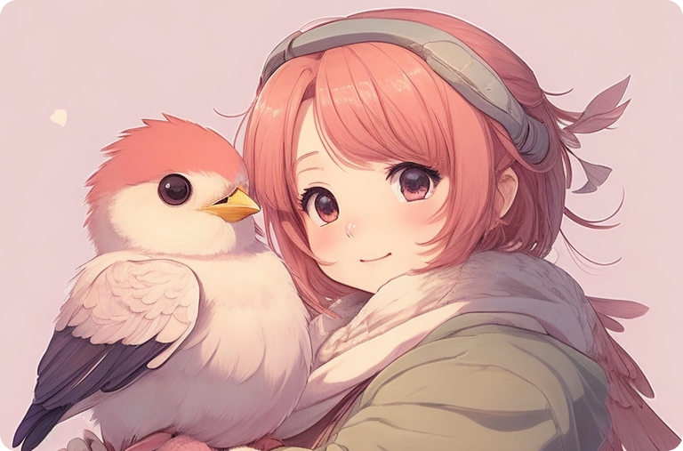

## はじめに
皆さんは、鳥がその頭を静止させる能力をもっていることをご存知ですか？
試しに「bird head stability」などで検索をかけてみてください。とてもかわいいですよ。


この現象に名前があるわけではないようです。
この能力は、鳥の「アトラント・オクシピタル関節（atlanto-occipital joint）」の柔軟性に起因するそうで、鳥は体が動いても頭を相対的に静止させることができます。
鳥の目はその眼窩であまり動かないため、頭を静止させることで、環境内のオブジェクトを追跡する能力が高まるそうです。

この性質を利用して、鳥の頭にカメラを取り付け、スタビライザー（ジンバル）のように動かないカメラを作る猛者もいるようです。アホですね（最大の褒め言葉）。大好きです。


https://www.youtube.com/watch?v=8A5cMcsYVHY

さて、この鳥の頭のように、人間の頭も相対的に静止させることができないでしょうか？
画像処理の技術を使えば、人間の頭を静止させることができるのではないかと考えました。

## 元動画
まずは、元動画をご覧ください。


https://github.com/yKesamaru/FacePositionStabilization/blob/57a2c6bb66d3ab325a40629872088c6bc9cb7d36/face_position.py#L31-L69


動画内で顔の位置が動く場合に、その顔を一定の位置に固定します。
具体的には、顔の中心を両目の中心に設定し、その位置を固定します。

## コードの主要部分

以下がコードの主要部分です。

```python
# 顔の検出
results = face_mesh.process(image_rgb)

if results.multi_face_landmarks:
    for face_landmarks in results.multi_face_landmarks:
        # 両目の中心を計算
        left_eye = face_landmarks.landmark[33]
        right_eye = face_landmarks.landmark[263]
        eye_x = int((left_eye.x + right_eye.x) * width // 2)
        eye_y = int((left_eye.y + right_eye.y) * height // 2)
        # ...（以下略）
```

## 各部分の詳細

### 顔の検出

```python
results = face_mesh.process(image_rgb)
```

この行で、RGB形式の画像（`image_rgb`）をMediaPipeのFace Meshモデルに渡して、顔のランドマークを検出しています。

### 両目の中心を計算

```python
left_eye = face_landmarks.landmark[33]
right_eye = face_landmarks.landmark[263]
eye_x = int((left_eye.x + right_eye.x) * width // 2)
eye_y = int((left_eye.y + right_eye.y) * height // 2)
```

ここでは、検出された顔のランドマークから左目（`landmark[33]`）と右目（`landmark[263]`）の位置を取得しています。そして、それらの平均位置を画像内での座標（`eye_x`, `eye_y`）に変換しています。

### 両目の距離とスケーリングファクターの計算

```python
eye_distance = int(np.sqrt((left_eye.x - right_eye.x)**2 + (left_eye.y - right_eye.y)**2) * width)
scale_factor = fixed_eye_distance / eye_distance
```

この部分で、両目の距離（`eye_distance`）とスケーリングファクター（`scale_factor`）を計算しています。スケーリングファクターは、固定したい両目の距離（`fixed_eye_distance`）を実際の両目の距離で割って求めます。

### 平行移動とスケーリング

```python
M_translate_scale = np.float32([[scale_factor, 0, fixed_eye_x - eye_x * scale_factor],
                                [0, scale_factor, fixed_eye_y - eye_y * scale_factor]])
image = cv2.warpAffine(image, M_translate_scale, (width, height))
```

`cv2.warpAffine`関数を使用して、計算したスケーリングファクターと両目の位置に基づいて画像を平行移動とスケーリングを行います。

### 画像の回転

```python
angle = np.arctan2((left_eye.y - right_eye.y) * height, (left_eye.x - right_eye.x) * width)
angle = np.degrees(angle)
M_rotate = cv2.getRotationMatrix2D((fixed_eye_x, fixed_eye_y), angle, 1)
image = cv2.warpAffine(image, M_rotate, (width, height))
```

最後に、`cv2.warpAffine`を再度使用して、画像を回転させます。回転角度は、両目の位置に基づいて`np.arctan2`関数で計算されます。

以上がこのコードの主要な部分とその解説です。このコードを使用することで、動画内での顔の位置を効果的に固定できます。

## 結果


## まとめ
